# Kompas

[](https://github.com/Brandt03/Kompas/actions/workflows/ci.yml)

**A personal dashboard that brings my finances, studies, training and job search together on one local page.**

Kompas runs entirely on my own Mac at `https://kompas.localhost`. Five small projects, written in Python and
JavaScript, each own one part of my life and publish their own pages. Kompas is the frame around them: one menu,
one design system, and a front page that pulls the day together across all of them.

> The interface is in Danish, because I built it for myself. This README and the overview are in English; the
> technical docs for each part are in Danish.

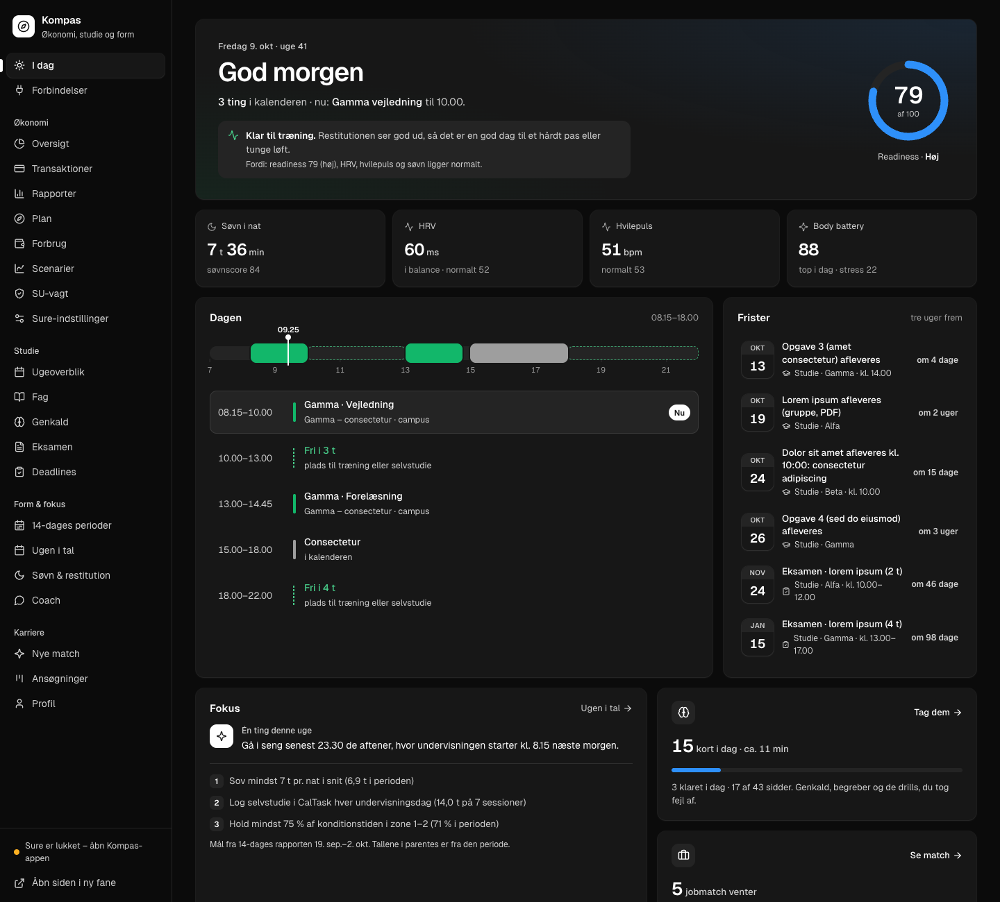

*All screenshots use made-up demo data and are taken from the demo with `node demo/skaermbilleder.mjs`. Run it
yourself with `python3 demo/serve.py` (see below).*

## What it does

| Area | What I see | Built from |
|---|---|---|
| **I dag** (Today) | My day across everything: calendar with free gaps, deadlines, readiness from my watch, this week's focus, flashcards due, new job matches | `public/` |
| **Økonomi** (Money) | Spending by month, "what if" scenarios, and a guard that warns before I earn too much to keep my student grant (SU) | `okonomi/` + [Sure](https://github.com/we-promise/sure) |
| **Studie** (Study) | Week plan, courses, deadlines, spaced-repetition flashcards, exam practice, and an offline phone app | `studie/` |
| **Form & fokus** (Health) | 14-day training periods, sleep and recovery, a daily recommendation, and a weekly review | `coach/` + `overblik/` |
| **Karriere** (Career) | A job agent that finds student jobs twice a week and scores them against my profile, with the reasons and gaps for each | `karriere/` |
| **Forbindelser** (Connections) | Whether every data source, Claude routine and background job works, with how to fix it when one doesn't | `bin/forbindelser.py` |

| | |
|---|---|
| 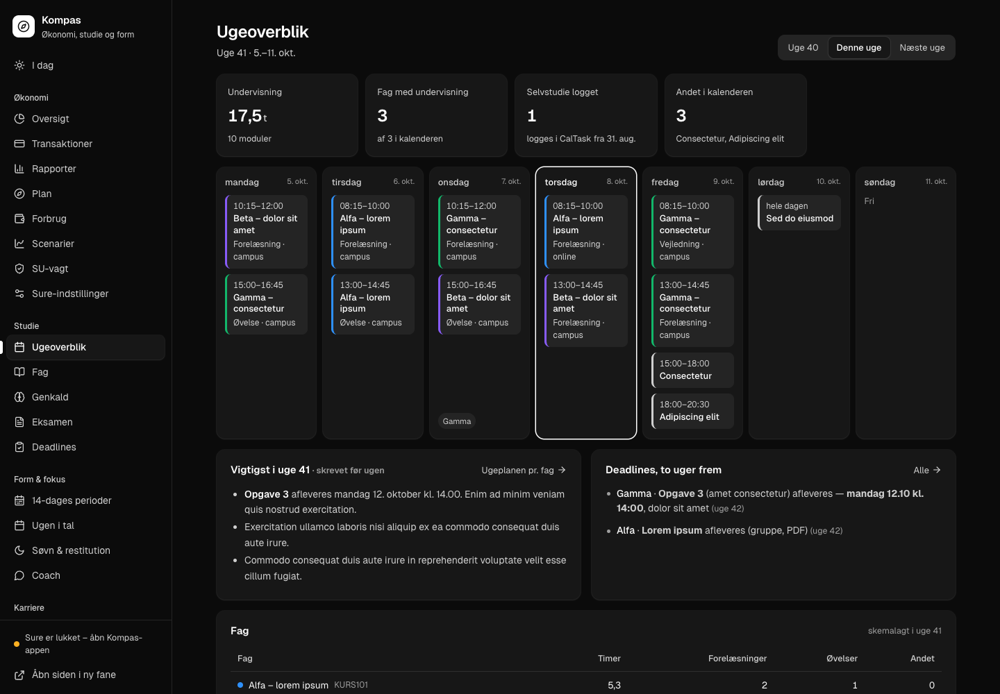 **Studie:** the week from my calendar, the plan for the week, and deadlines | 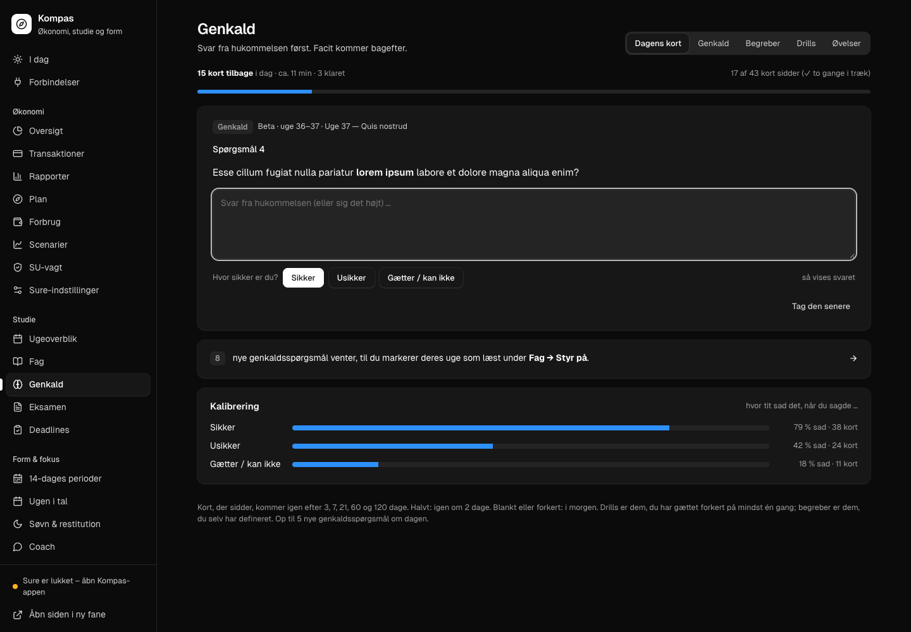 **Genkald:** today's flashcards, with how often "sure" was actually right |
| 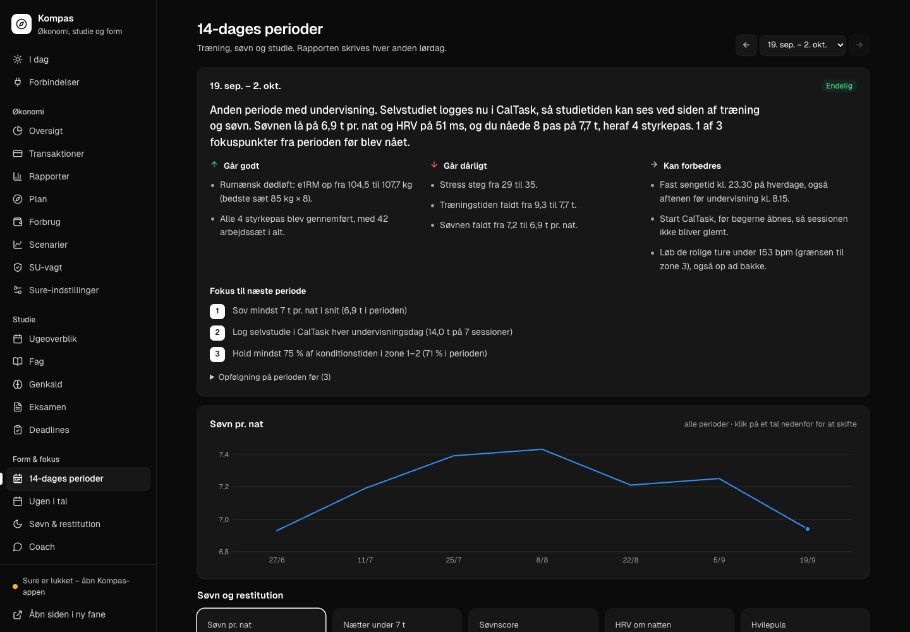 **Form & fokus:** the 14-day report, its goals and the trend over periods | 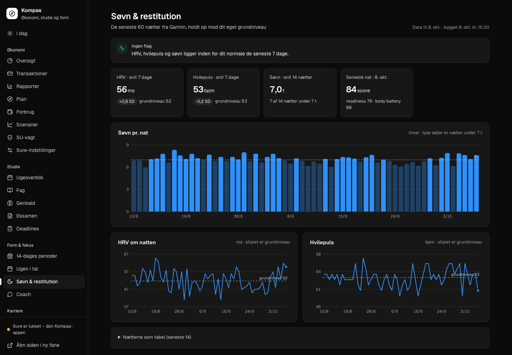 **Søvn & restitution:** 60 nights against my own baseline |
| 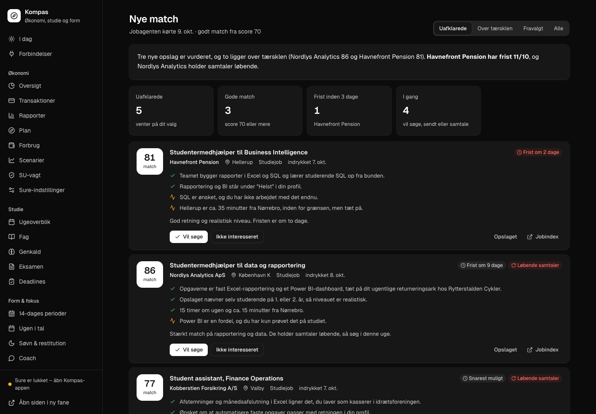 **Karriere:** scored job matches with reasons and gaps | 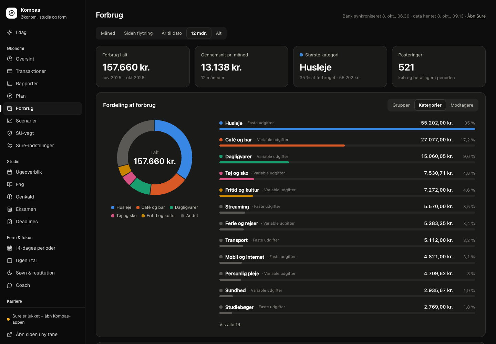 **Forbrug:** where the money went over 12 months |
| 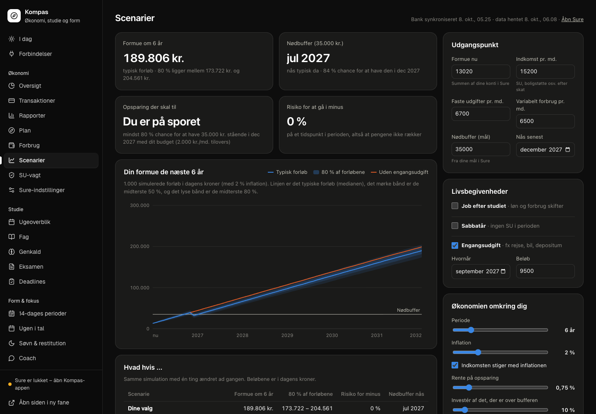 **Scenarier:** 1,000 simulated futures for my savings | 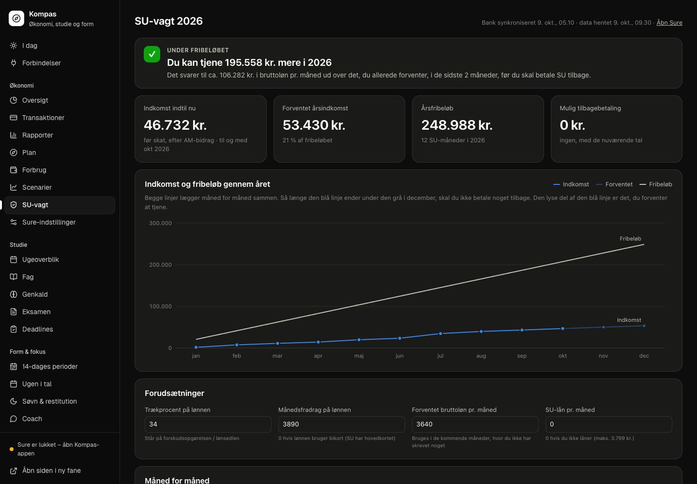 **SU-vagt:** income against the student grant limit |

<p align="center">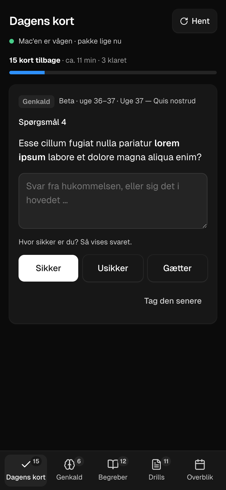<br>
<em>On the phone: today's cards work offline and sync later.</em></p>

Everything follows the system's light or dark mode ([light version of I dag](docs/skaermbilleder/i-dag-lys.png)).
[Forbindelser](docs/skaermbilleder/forbindelser.png) shows whether everything Kompas depends on works: it tests the
MCP server with a real handshake, reads the Claude routines' own schedules, and never reads secrets, only whether
they are set.

## How it fits together

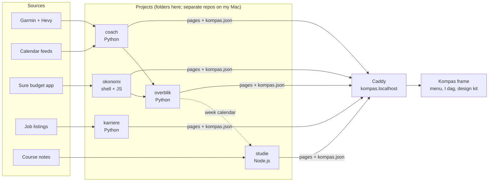

- **One contract.** Every project writes its pages plus a small `kompas.json` that describes them. The frame
  builds its menu from those files, so adding a project never touches the frame's code. Pages without data
  simply drop out instead of breaking the page.
- **Projects compute, pages show.** Numbers are calculated once, in the project that owns them, and written as
  JSON. The pages only display them, so the same figure never disagrees between two pages.
- **Local first.** Everything is served by Caddy on `localhost`, kept fresh by macOS LaunchAgents every 30
  minutes, and backed up daily. Nothing is hosted anywhere.
- **Read-only by default.** The pages only write what I type or click, and only through three servers:
  Karriere's (job decisions, profile, threshold), Studie's (flashcard answers and marks, definitions, drill
  guesses, weeks marked as read, practice exams, deadlines marked done) and Sure's (the inputs on Scenarier and
  SU-vagt, behind Sure's login). Karriere's and Studie's servers bind to `127.0.0.1`, answer only to Kompas' own
  host names (against DNS rebinding), and accept writes only from Kompas' own origin.
- **Phone without a server.** The study pages work offline on my phone as a small PWA. It downloads today's
  cards while my Mac is reachable over Tailscale, and syncs the answers back later without duplicates.
- **AI where judgement is needed.** Scheduled Claude routines do the parts that need judgement: the weekly
  study plan, the 14-day training review, the weekly life review and scoring job listings. They only write
  files that the projects then show; they never send or submit anything.

The full architecture is in [docs/arkitektur.md](docs/arkitektur.md) (Danish). On my Mac each project is its own git
repository; this public repository gathers them as folders, cleaned of personal data, so its history starts at
publication.

## Try the demo

You only need Python 3.9 or newer; no packages, no accounts.

```bash
python3 demo/serve.py
```

Then open http://localhost:8000. The demo generates made-up data around today's date, so the calendar,
deadlines and countdowns look alive whenever you run it. The demo server refuses every write, so nothing is
saved on disk; only Scenarier and SU-vagt keep what you type in your own browser, as they do when Sure is closed.
Sure itself is not part of the demo (its menu items show a short explanation instead).

## The projects

### [coach/](coach/): training, sleep and recovery (Python, SQLite, MCP)

- Pulls my Garmin data, Hevy strength sets and calendar feeds into SQLite. Raw Garmin JSON is kept, so a broken
  unofficial endpoint never costs history, and a workout logged in both apps is counted once.
- `metrics.py` computes everything: acute:chronic workload, monotony, HRV and resting heart rate as deviations
  from a 60-day baseline, Banister TRIMP, strength load calibrated to TRIMP, and estimated 1RM. Gaps stay gaps
  (`null`, not 0), and each figure carries the reason it is or isn't shown.
- A local **MCP server** with 12 tools lets Claude answer questions about my training from finished aggregates
  instead of doing arithmetic on raw series. Its SQL lookup is read-only, enforced by SQLite itself.
- `site byg` writes the pages' JSON atomically, plus the daily recommendation shown on the front page.

### [overblik/](overblik/): the weekly review (Python)

- One row per ISO week across training, money and study, built from Garmin data, the Sure extract and the
  calendar.
- Flags unusual weeks with a robust z-score (median/MAD) against the previous 8 weeks. When most weeks are
  identical (say, nothing spent on cafés), a week only stands out if it falls outside all 8 weeks and differs
  from the median by a fixed amount per column (100 kr., half an hour of training), so 899 kr. after weeks of
  900 kr. is not news.
- Instead of mining every pair of columns for correlations, it tests 11 fixed hypotheses, Bonferroni-corrected.
  Each week is compared with its neighbours (up to 4 weeks, as many on each side) before testing, so a shared
  drift over the semester doesn't count as a link, and p-values come from a block permutation (blocks of 3
  weeks), because neighbouring weeks resemble each other. In simulations this cut false "strong" links from 39 %
  to under 1 % for drifting series, and from 100 % to 0 % for a shared seasonal pattern, while still finding a
  real week-to-week link 90 % of the time.
- Training load comes from coach (TRIMP), the same number everywhere.

### [studie/](studie/): study planner and flashcards (Node.js)

- **The files are the database.** The server reads and writes my own markdown notes (answers, ✓/~/✗ marks,
  definitions) and JavaScript drills. A guess is written into the drill file, the file is run with Node, and
  JavaScript itself decides whether the guess was right. If the file breaks, it is restored.
- **Spaced repetition without hidden state.** Today's cards are computed from an append-only JSONL log and
  scheduled with FSRS-6: a card comes back when I'm predicted to recall it with 90 % probability, and before an exam
  when it would otherwise be below 95 % on the day. New questions only come from weeks I have marked as read, and the page shows
  how often an answer was actually right when I said I was sure.
- **A new semester is a new `fag.json`.** The code knows no courses: one file lists the semester's courses and
  what each has (recall questions, a glossary, code drills, numbered hand-ins, exam form), and exam dates are read
  from my notes. A test runs the server on a made-up semester and fails if a course id is hardcoded.
- **Offline first on the phone.** *På farten* downloads a package of today's cards over Tailscale, queues
  answers without a connection, and sends them later. Each answer has an id, so sending twice is harmless. A
  service worker serves the pages from cache.
- **No dependencies.** Plain Node.js with its own small markdown renderer and a mini XML reader that turns my
  Word course notes into HTML with images.
- **Careful writes.** Only Kompas may write (Host, Origin and JSON content-type checks), and files are written
  atomically (a unique temp file + rename). A drill guess is parsed as a plain value (numbers, strings, lists,
  objects, `NaN`, `undefined` …) and written back in the server's own form, so a guess can never run as code.
- **Answer first, then the key.** The pages only ask for the answer key after an attempt. That is a habit the
  interface keeps, not a lock: `GET /facit` and `/eksamen/facit` return the key whenever they are asked.

### [karriere/](karriere/): job agent (Python + a Claude routine)

- A deterministic fetcher (standard library only) reads new student-job listings, pre-filters them with weighted
  word lists and queues the relevant ones.
- A scheduled Claude routine follows [RUTINE.md](karriere/RUTINE.md): it scores each listing 0–100 on a fixed
  five-part rubric with caps, and writes down why it fits and what is missing. Listings are treated as data, not
  instructions (prompt-injection defence), and the routine only writes its assessments; it never applies for
  anything or contacts anyone.
- I decide in Kompas (want to apply, or not interested and why). The decisions are logged and read by the next
  run, which uses them as a signal and suggests changes to the profile or filters without making them itself.
- A small standard-library HTTP server with exactly three narrow writes (status, profile, threshold), taken one
  at a time under a lock with atomic file writes, Host checks against DNS rebinding, Origin/Content-Type checks
  against CSRF, and path-traversal guards.

### [okonomi/](okonomi/): money, on top of Sure (shell, SQL, JavaScript, a little Ruby)

- [Sure](https://github.com/we-promise/sure) runs untouched in Docker. My additions are mounted as Rails
  initializers that check that what they change exists and switch themselves off otherwise, so updating Sure
  never breaks it.
- `export.sh` builds the whole extract as JSON inside Postgres in one query, every 5 minutes, so the pages keep
  working when Sure and Docker are closed.
- **Scenarier** is a Monte Carlo simulation (1,000 runs) that samples my own variable spending from history,
  models returns as log-normal, shows everything in today's money, and uses binary search to find the smallest
  extra monthly saving that reaches a goal with 80 % probability.
- **SU-vagt** knows the 2026 rules for the Danish student grant: the monthly income limits, converting net pay
  to taxable income, what an overshoot costs to pay back, and which months it pays to opt out of the grant.
- One app starts everything (Caddy, LaunchAgents, Docker, Sure, bank sync, export), and one closes it again,
  with a verified `pg_dump` backup and 30-day rotation on the way out.

## Tests

Every push runs [CI](.github/workflows/ci.yml): the demo is generated and served on Python 3.9 and 3.13, coach's
smoke test runs against its real dependencies, and [tests/](tests/) checks the parts that matter most:

- **Overblik's statistics:** a week that stands out from identical weeks is flagged, a shared seasonal pattern is
  not reported as a link, and a real week-to-week link is still found.
- **Karriere's server:** foreign host names are refused (DNS rebinding), writes need Kompas' own origin, a negative
  `Content-Length` is rejected, and 30 simultaneous status changes all end up in the file.
- **Coach's numbers** against known answers: Banister TRIMP, ACWR (1.0 for even load, 1.6 when the last week
  doubles), HRV as standard deviations from the baseline, and gaps that stay gaps instead of turning into zeros.
- **Studie's drill guesses** are parsed as values: known code-injection attempts are refused.
- **Studie's spaced repetition:** FSRS gives known answers for first reviews, longer intervals for easier grades, and
  pulls a card forward before an exam; and
  answers synced from the phone are saved once, even when the same answer is sent twice.

```bash
python3 -m unittest discover -s tests
node tests/test_drill_gaet.js
node tests/test_studie_repetition.js
```

## Running it for real

**Status: a personal project, not a product.** Kompas is built for my own everyday life on my own Mac, so the
demo is the easy way to see all of it. Running it with your own data takes some adapting:

- It is macOS only (LaunchAgents, zsh, Docker via Colima for Sure).
- Each part is set up on its own: Caddy, Sure, Garmin and calendar feeds, Hevy, and Tailscale for the phone.
  There is no single installer.
- The LaunchAgents, the small app that starts and stops everything, and most of the scheduled Claude routines
  are not in the repository.
- It assumes three courses, Danish student grant (SU) rules and Danish job listings, and the interface is in
  Danish.

Each project has its own README with setup and environment variables. The short version: clone into `~/kompas`,
import the `Caddyfile` into Caddy, set up each project you want, and point the LaunchAgents at `bin/opdater.sh`
and the two small servers. See [docs/arkitektur.md](docs/arkitektur.md).

## How I built it

I designed and built Kompas with [Claude Code](https://claude.com/claude-code) as my pair programmer. I decided
what each part should do and how the parts fit together. I reviewed and tested the changes, and I use the
system every day. The scheduled AI routines above are part of the design: they run inside clear rules (what
they may read, what they may write, and that they never act on my behalf).

## License

My code is MIT licensed (see [LICENSE](LICENSE)). The Geist font (OFL), Lucide icons (ISC) and Sure's design
tokens (AGPL-3.0) keep their own licences, and the small add-ons in `okonomi/custom/` that run inside Sure are
AGPL-3.0 like Sure. [THIRD_PARTY_NOTICES.md](THIRD_PARTY_NOTICES.md) lists the files and where their licence
texts are.
